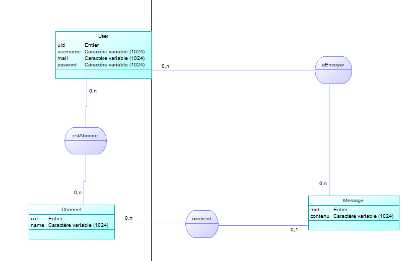

# Description Générale de l'Application
QGChat est une application web permettant aux utilisateurs de créer et gérer des fils de discussion avec un ou plusieurs participants. Chaque utilisateur peut poster et lire des messages dans ces fils. L’application suit une architecture MVC en JEE, avec une interface responsive compatible avec ordinateur et mobile.

## Fonctionnalités

- **Authentification** : Les utilisateurs peuvent s'inscrire, se connecter et se déconnecter.
- **Création de Channels** : Les utilisateurs peuvent créer des channels.
- **Partage de Channels** : Les utilisateurs peuvent partager des channels avec d'autres utilisateurs via un lien ou un QR code proteger via des tokens JWT temporaires.
- **Messages** : Les utilisateurs peuvent poster des messages dans les channels (texte, images, video, audio), les modifier et les supprimer si ils sont les auteurs.
- **Markdown** : Les utilisateurs peuvent utiliser la syntaxe Markdown pour formater leurs messages.
- **Réactions** : Les utilisateurs peuvent réagir aux messages avec des emojis.
- **Abonnements** : Les utilisateurs peuvent s'abonner à des channels si ils ont été invités ou ajoutés.
- **Administration** : Les utilisateurs peuvent être administrateurs de channels (ajouter des membres, supprimer des messages, promouvoir des administrateurs, changer le nom, durée de vie des messages).
- **Amis** : Les utilisateurs peuvent ajouter des amis et envoyer des messages privés.
- **Personnalisation** : Les utilisateurs peuvent modifier leur profil (photo de profil, nom d'utilisateur, mail).
- **Configuration** : Le serveur est configurable via un fichier `config.yml` dans son dossier `WEB-INF/classes`. (debug, taille max des fichiers, connexion à la base de données).


# Installation et Utilisation

## Docker
### Demarrage
Pour lancer l'application avec Docker, il suffit de lancer la commande suivante :
```bash
docker compose -f compose.prod.yml up -d --build
```
### Configuration
l'application à bessoin d'un fichier config.yml a la racine du projet pour fonctionner, voici un exemple de fichier de configuration :
```yaml
database:
  host: "postgres"
  port: "5432"
  user: "sae"
  database: "sae"
  password: "sae"
debug: false
upload:
  video_max_size: "20mo"
  audio_max_size: "20mo"
  image_max_size: "2mo"
```
### Initialisation de la base de données
il faut lancer le script `tables.sql` pour créer les tables et les données de test.
```bash
docker exec -it postgres bash
psql -U sae
\i docker-entrypoint-initdb.d/tables.sql
```

## Utilisation
L'application est accessible à l'adresse suivante : [http://localhost:6998/sae/home](http://localhost:6998/sae/home)

## Installation Manuelle
Il vous faut installer tomcat et mettre en place une base de données PostgreSQL.
placer le projet dans le dossier webapps de tomcat.
puis compiler le projet.
### Compilation
```bash
cd /path/to/tomcat/webapps/sae
javac -cp /path/to/tomcat/lib/*:/path/to/tomcat/webapps/sae/WEB-INF/lib/* $(find /path/to/tomcat/webapps/sae/WEB-INF/src/ -name "*.java") -d /path/to/tomcat/webapps/sae/WEB-INF/classes/
```

### Configuration
Il faut configurer le fichier `config.yml` à la racine du projet.
```yaml
database:
  host: "localhost"
  port: "5432"
  user: "sae"
  database: "sae"
  password: "sae"
debug: false
upload:
  video_max_size: "20mo"
  audio_max_size: "20mo"
  image_max_size: "2mo"
```

### Initialisation de la base de données
il faut lancer le script `tables.sql` pour créer les tables.

### Utilisation
L'application est accessible à l'adresse suivante : [http://localhost:8080/sae/home](http://localhost:8080/sae/home)

# Modélisation

## Modèle Conceptuel de Données (MCD)



## Modèle Logique de Données (MLD)

`#`: Clé étrangère  
__en gras__: Clé primaire

Utilisateur(__uid__, username, mail, password, profile_picture)

Channel(__cid__, name, minuteBeforeExpiration)

isFriend(__#uid1,#uid2,#cid__)

FriendRequest(__#senderUid,#receiverUid__)

Message(__mid__, type, #uid, #cid, contenu, timestamp)

estAbonne(__#uid,#cid__)

isAdmin(__#uid,#cid__)

likes(__#mid,#uid__, emoji)


# Requêtes SQL Pertinentes
Fichier de création des tables et des données :
[Fichier](tables.sql)

### Création des Tables
```sql
CREATE TABLE Utilisateur (
    uid SERIAL PRIMARY KEY,
    username VARCHAR(1024) NOT NULL,
    mail VARCHAR(1024) NOT NULL UNIQUE,
    password VARCHAR(1024) NOT NULL,
    profile_picture TEXT,
    CONSTRAINT check_mail_not_empty CHECK (mail <> ''),
    CONSTRAINT check_username_not_empty CHECK (username <> ''),
    CONSTRAINT check_password_not_empty CHECK (password <> '')
);

CREATE TABLE Channel (
    cid SERIAL PRIMARY KEY,
    minuteBeforeExpiration INT DEFAULT -1,
    name VARCHAR(1024) NOT NULL
);

CREATE TABLE isFriend
(
    uid1 INT,
    uid2 INT,
    cid  INT,
    PRIMARY KEY (uid1, uid2, cid),
    FOREIGN KEY (uid1) REFERENCES Utilisateur (uid) ON DELETE CASCADE,
    FOREIGN KEY (uid2) REFERENCES Utilisateur (uid) ON DELETE CASCADE,
    FOREIGN KEY (cid) REFERENCES Channel (cid) ON DELETE CASCADE,
    CHECK ( uid1 <> uid2 )
);

CREATE TABLE FriendRequest
(
    senderUid   INT,
    receiverUid INT,
    PRIMARY KEY (senderUid, receiverUid),
    FOREIGN KEY (senderUid) REFERENCES Utilisateur (uid) ON DELETE CASCADE,
    FOREIGN KEY (receiverUid) REFERENCES Utilisateur (uid) ON DELETE CASCADE,
    CHECK ( senderUid <> receiverUid )
);


CREATE TABLE Message (
    mid SERIAL PRIMARY KEY ,
    type varchar(1024) NOT NULL default 'text',
    uid INT NOT NULL,
    cid INT NOT NULL,
    contenu TEXT NOT NULL,
    timestamp TIMESTAMP DEFAULT CURRENT_TIMESTAMP,
    CONSTRAINT fk_user FOREIGN KEY (uid) REFERENCES Utilisateur(uid) ON DELETE CASCADE,
    CONSTRAINT fk_channel FOREIGN KEY (cid) REFERENCES Channel (cid) ON DELETE CASCADE,
    CONSTRAINT check_contenu_not_empty CHECK (contenu <> ''),
    CONSTRAINT check_type CHECK (type IN ('text', 'image', 'video', 'audio'))
);

CREATE TABLE estAbonne (
    uid INT,
    cid INT,
    PRIMARY KEY (uid, cid),
    FOREIGN KEY (uid) REFERENCES Utilisateur(uid) ON DELETE CASCADE,
    FOREIGN KEY (cid) REFERENCES Channel(cid) ON DELETE CASCADE
);

CREATE TABLE isAdmin (
    uid INT,
    cid INT,
    PRIMARY KEY (uid, cid),
    FOREIGN KEY (uid) REFERENCES Utilisateur(uid) ON DELETE CASCADE,
    FOREIGN KEY (cid) REFERENCES Channel(cid) ON DELETE CASCADE
);

CREATE TABLE likes (
    mid INT,
    uid INT,
    emoji VARCHAR(5),
    PRIMARY KEY (mid, uid),
    CONSTRAINT fk_likes_message FOREIGN KEY (mid) REFERENCES Message(mid) ON DELETE CASCADE,
    CONSTRAINT fk_likes_utilisateur FOREIGN KEY (uid) REFERENCES Utilisateur(uid) ON DELETE CASCADE
);
```

### Insertion de Données Exemple
```sql
INSERT INTO Utilisateur (username, mail, password) VALUES
('user1', 'user1@example.com', MD5('password1')),
('user2', 'user2@example.com', MD5('password2')),
('user3', 'user3@example.com', MD5('password3'));


INSERT INTO Channel (name) VALUES
('General'),
('Random'),
('Announcements');

INSERT INTO isAdmin (uid, cid) VALUES
(1, 1),
(2, 2),
(3, 3);

INSERT INTO Message (contenu, uid, cid) VALUES
('Hello World', 1, 1),
('Bonjour le monde', 2, 1),
('Hola Mundo', 3, 1),
('Random message', 1, 2),
('Another random message', 2, 2),
('Un autre message random', 3, 2),
('Announcement', 1, 3),
('Another announcement', 2, 3),
('Un autre annonce', 3, 3);

INSERT INTO estAbonne (uid, cid) VALUES
 (1, 1),
 (2, 1),
 (2,3),
 (3, 2);

```

### Requêtes Fréquentes
```sql
-- 1. Récupérer les messages d'un channel
SELECT * FROM Message WHERE cid = ?;

-- 2. Récupérer les messages d'un utilisateur dans un channel
SELECT * FROM Message WHERE cid = ? AND uid = ?;

-- 3. Récupérer les likes d'un message
SELECT * FROM likes WHERE mid = ?;

-- 4. Récupérer les administrateurs d'un channel
SELECT * FROM isAdmin WHERE cid = ?;

-- 5. Récupérer les abonnés d'un channel
SELECT * FROM estAbonne WHERE cid = ?;

-- 6. Récupérer les amis d'un utilisateur
SELECT * FROM isFriend WHERE uid1 = ? OR uid2 = ?;

-- 7. Récupérer les demandes d'amis d'un utilisateur
SELECT * FROM FriendRequest WHERE receiverUid = ?;

-- 8. Récupérer les utilisateurs qui ne sont pas amis avec un utilisateur
WITH friends(uid) AS (
    SELECT uid1 AS uid FROM isFriend WHERE uid2 = ?
    UNION
    SELECT uid2 AS uid FROM isFriend WHERE uid1 = ?
)
SELECT * FROM Utilisateur WHERE uid NOT IN (SELECT uid FROM friends) AND uid != ?;

-- 9. creer un utilisateur
INSERT INTO Utilisateur (username, mail, password) VALUES (?, ?, ?);

-- 10. creer un message
INSERT INTO Message (type, uid, cid, contenu) VALUES (?, ?, ?, ?);

-- 11. creer un channel
INSERT INTO Channel (name) VALUES (?);

-- 12. creer une demande d'amis
INSERT INTO FriendRequest (senderUid, receiverUid) VALUES (?, ?);

-- 13. creer un like
INSERT INTO likes (mid, uid, emoji) VALUES (?, ?, ?);

-- 14. creer un abonnement
INSERT INTO estAbonne (uid, cid) VALUES (?, ?);

-- 15. creer un administrateur
INSERT INTO isAdmin (uid, cid) VALUES (?, ?);

-- 16. supprimer un utilisateur
DELETE FROM Utilisateur WHERE uid = ?;

-- 17. supprimer un message
DELETE FROM Message WHERE mid = ?;

-- 18. supprimer un channel
DELETE FROM Channel WHERE cid = ?;

-- 19. supprimer une demande d'amis
DELETE FROM FriendRequest WHERE senderUid = ? AND receiverUid = ?;

-- 20. Récupérer tous les utilisateurs
SELECT * FROM Utilisateur;

-- 21. Récupérer tous les canaux
SELECT * FROM Channel;
```

# Arborescence Globale de l’Application
```
/Projet_SAE
├───res
│   └───documentation
│           MCD.png
│           SI.PNG
│
├───scripts
│       home.js
│
└───WEB-INF
    │   WEB-INF.iml
    │   web.xml
    │
    ├───classes
    │   │   config.yml
    │   │   default1.png
    │   │   default2.png
    │   │   default3.png
    │   └───default4.png
    │
    ├───jsp
    │   │   createChannel.jsp
    │   │   editUser.jsp
    │   │   error.jsp
    │   │   friend.jsp
    │   │   home.jsp
    │   │   join.jsp
    │   │   login.jsp
    │   │   ModifChannel.jsp
    │   │   share.jsp
    │   │
    │   └───components
    │       │   message.jsp
    │       │   TopBar.jsp
    │       │
    │       └───messagePart
    │               DeleteAndAditForm.jsp
    │               ReactionForm.jsp
    │               UserProfile.jsp
    │
    ├───lib
    │       jackson-annotations-2.15.3.jar
    │       jackson-core-2.15.3.jar
    │       jackson-databind-2.15.3.jar
    │       jackson-dataformat-xml-2.15.3.jar
    │       jjwt-api-0.12.5.jar
    │       jjwt-impl-0.12.5.jar
    │       jjwt-jackson-0.12.5.jar
    │       postgresql-42.7.5.jar
    │       snakeyaml-2.4.jar
    │
    └───src
        └───fr
            └───univ
                └───lille
                    └───s4a021
                        │   Config.java
                        │
                        ├───controller
                        │       AbstractController.java
                        │       ChannelController.java
                        │       JSP.java
                        │       MainController.java
                        │       MessageController.java
                        │       UserController.java
                        │
                        ├───dao
                        │   │   AdminsDAO.java
                        │   │   ChannelDAO.java
                        │   │   FriendDAO.java
                        │   │   MessageDAO.java
                        │   │   ReactionDAO.java
                        │   │   SubscriptionDAO.java
                        │   │   UserDAO.java
                        │   │
                        │   └───impl
                        │           AdminsDAOSql.java
                        │           ChannelDAOSql.java
                        │           DaoSql.java
                        │           FriendDAOSql.java
                        │           MessageDAOSql.java
                        │           ReactionDaoSql.java
                        │           SubscriptionDAOSql.java
                        │           UserDAOSql.java
                        │
                        ├───dto
                        │       Channel.java
                        │       ImgMessage.java
                        │       Message.java
                        │       User.java
                        │
                        ├───exception
                        │   │   BadParameterException.java
                        │   │   ConfigErrorException.java
                        │   │   MyDiscordException.java
                        │   │   UnauthorizedException.java
                        │   │
                        │   └───dao
                        │       │   CreationException.java
                        │       │   DaoException.java
                        │       │   DataAccessException.java
                        │       │   NotFoundException.java
                        │       │   UpdateException.java
                        │       │
                        │       ├───admin
                        │       │       AdminCreationException.java
                        │       │       AdminNotFoundException.java
                        │       │
                        │       ├───channel
                        │       │       ChannelCreationException.java
                        │       │       ChannelNotFoundException.java
                        │       │       ChannelUpdateException.java
                        │       │
                        │       ├───message
                        │       │       MessageCreationException.java
                        │       │       MessageNotFoundException.java
                        │       │       MessageUpdateException.java
                        │       │
                        │       ├───reaction
                        │       │       ReactionCreationException.java
                        │       │       ReactionNotFoundException.java
                        │       │       ReactionUpdateException.java
                        │       │
                        │       │
                        │       ├───subscription
                        │       │       SubscriptionNotFoundException.java
                        │       │
                        │       └───user
                        │               UserCreationException.java
                        │               UserNotFoundException.java
                        │               UserUpdateException.java
                        │
                        ├───model
                        │   └───bdd
                        │           Connect.java
                        │           Util.java
                        │
                        └───util
                                JwtManager.java
                                Pair.java

```

# UML de l’Application
[voir ici](UML.png)


# Liste des Entrées des Contrôleurs

| Route      | Fonctionnalité              |
|------------|-----------------------------|
| `/home`    | page principale             |
| `/user`    | contrôleur des utilisateurs |
| `/channel` | contrôleur des channels     |
| `/message` | contrôleur des messages     |
| `/api`     | contrôleur api              |

# Points Techniques Difficiles et Résolutions

- **Sécurité des requêtes SQL** : Utilisation de requêtes préparées pour éviter les injections SQL.
- **XSS Protection** : Filtrage des entrées utilisateur avec `escapeHtml4`.

