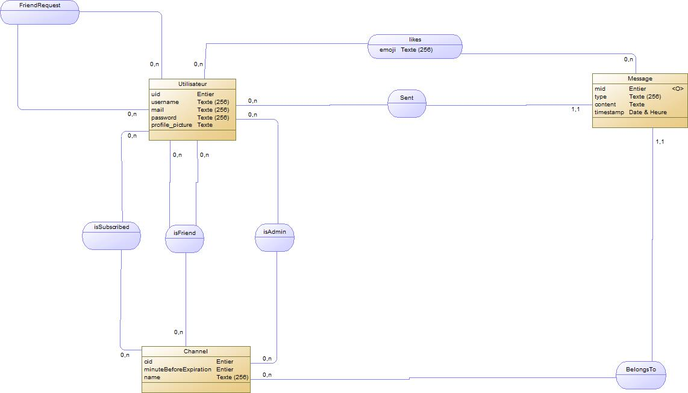

# Description Générale de l'Application
QGChat est une application web permettant aux utilisateurs de créer et gérer des fils de discussion avec un ou plusieurs participants. Chaque utilisateur peut poster et lire des messages dans ces fils. L’application suit une architecture MVC en JEE, avec une interface responsive compatible avec ordinateur et mobile.

# Modélisation

## Modèle Conceptuel de Données (MCD)


## Modèle Logique de Données (MLD)
```
// Insérer ici le MLD sous forme textuelle
```

# Requêtes SQL Pertinentes

### Création des Tables
```sql
CREATE TABLE Utilisateur (
                             uid SERIAL PRIMARY KEY,
                             username VARCHAR(1024) NOT NULL,
                             mail VARCHAR(1024) NOT NULL UNIQUE,
                             password VARCHAR(1024) NOT NULL,
                             profile_picture TEXT,
                             CONSTRAINT check_mail_not_empty CHECK (mail <> ''),
                             CONSTRAINT check_username_not_empty CHECK (username <> ''),
                             CONSTRAINT check_password_not_empty CHECK (password <> '')
);

CREATE TABLE isFriend (
                          uid1 INT,
                          uid2 INT,
                          PRIMARY KEY (uid1, uid2),
                          FOREIGN KEY (uid1) REFERENCES Utilisateur(uid) ON DELETE CASCADE,
                          FOREIGN KEY (uid2) REFERENCES Utilisateur(uid) ON DELETE CASCADE
);

-- Création de la table Channel
CREATE TABLE Channel (
                         cid SERIAL PRIMARY KEY,
                         minuteBeforeExpiration INT DEFAULT -1,
                         name VARCHAR(1024) NOT NULL
);

-- Création de la table Message
CREATE TABLE Message (
                         mid SERIAL PRIMARY KEY ,
                         uid INT NOT NULL,
                         cid INT NOT NULL,
                         contenu TEXT NOT NULL,
                         timestamp TIMESTAMP DEFAULT CURRENT_TIMESTAMP,
                         CONSTRAINT fk_user FOREIGN KEY (uid) REFERENCES Utilisateur(uid) ON DELETE CASCADE,

                         CONSTRAINT fk_channel FOREIGN KEY (cid) REFERENCES Channel(cid) ON DELETE CASCADE
);

-- Table de liaison estAbonne (User - Channel)
CREATE TABLE estAbonne (
                           uid INT,
                           cid INT,
                           PRIMARY KEY (uid, cid),
                           FOREIGN KEY (uid) REFERENCES Utilisateur(uid) ON DELETE CASCADE,
                           FOREIGN KEY (cid) REFERENCES Channel(cid) ON DELETE CASCADE
);

CREATE TABLE isAdmin (
                         uid INT,
                         cid INT,
                         PRIMARY KEY (uid, cid),
                         FOREIGN KEY (uid) REFERENCES Utilisateur(uid) ON DELETE CASCADE,
                         FOREIGN KEY (cid) REFERENCES Channel(cid) ON DELETE CASCADE
);

-- Tabme de liaison likes (Message - Utilisateur)
CREATE TABLE likes (
                       mid INT,
                       uid INT,
                       emoji VARCHAR(5),
                       PRIMARY KEY (mid, uid),
                       CONSTRAINT fk_likes_message FOREIGN KEY (mid) REFERENCES Message(mid) ON DELETE CASCADE,
                       CONSTRAINT fk_likes_utilisateur FOREIGN KEY (uid) REFERENCES Utilisateur(uid) ON DELETE CASCADE
);
```

### Insertion de Données Exemple
```sql
INSERT INTO Utilisateur (username, mail, password) VALUES
('user1', 'user1@example.com', MD5('password1')),
('user2', 'user2@example.com', MD5('password2')),
('user3', 'user3@example.com', MD5('password3'));

INSERT INTO Channel (name) VALUES
('General'),
('Random'),
('Announcements');

INSERT INTO Message (contenu) VALUES
('Welcome to the General channel!'),
('This is a random message.'),
('Important announcement: Meeting at 3 PM.');

INSERT INTO estAbonne (uid, cid) VALUES
(1, 1),
(2, 1),
(3, 2);

INSERT INTO aEnvoyer (uid, mid) VALUES
(1, 1),
(2, 2),
(3, 3);

INSERT INTO contient (cid, mid) VALUES
(1, 1),
(2, 2),
(3, 3);
```

### Requêtes Fréquentes
```sql
-- Récupérer tous les utilisateurs
SELECT * FROM Utilisateur;

-- Récupérer tous les canaux
SELECT * FROM Channel;

-- Récupérer tous les messages d’un canal donné
SELECT m.* FROM Message m
JOIN contient c ON m.mid = c.mid
WHERE c.cid = ?;

-- Récupérer tous les abonnements d’un utilisateur
SELECT c.* FROM Channel c
JOIN estAbonne e ON c.cid = e.cid
WHERE e.uid = ?;

-- Récupérer les messages envoyés par un utilisateur
SELECT m.* FROM Message m
JOIN aEnvoyer a ON m.mid = a.mid
WHERE a.uid = ?;

-- Vérifier si un utilisateur est abonné à un canal
SELECT * FROM estAbonne WHERE uid = ? AND cid = ?;

-- Ajouter un nouvel utilisateur
INSERT INTO Utilisateur (username, mail, password) VALUES (?, ?, MD5(?));

-- Ajouter un nouveau message dans un canal
INSERT INTO Message (contenu) VALUES (?);
INSERT INTO contient (cid, mid) VALUES (?, LAST_INSERT_ID());

-- Ajouter un abonnement
INSERT INTO estAbonne (uid, cid) VALUES (?, ?);
```

# Arborescence Globale de l’Application
```
/Projet_SAE
├───res
│   └───documentation
│           MCD.png
│           SI.PNG
│
├───scripts
│       home.js
│
└───WEB-INF
    │   WEB-INF.iml
    │   web.xml
    │
    ├───classes
    │   │   config.yml
    │   │   default1.png
    │   │   default2.png
    │   │   default3.png
    │   └───default4.png
    │
    ├───jsp
    │   │   createChannel.jsp
    │   │   editUser.jsp
    │   │   error.jsp
    │   │   friend.jsp
    │   │   home.jsp
    │   │   join.jsp
    │   │   login.jsp
    │   │   ModifChannel.jsp
    │   │   share.jsp
    │   │
    │   └───components
    │       │   message.jsp
    │       │   TopBar.jsp
    │       │
    │       └───messagePart
    │               DeleteAndAditForm.jsp
    │               ReactionForm.jsp
    │               UserProfile.jsp
    │
    ├───lib
    │       jackson-annotations-2.15.3.jar
    │       jackson-core-2.15.3.jar
    │       jackson-databind-2.15.3.jar
    │       jackson-dataformat-xml-2.15.3.jar
    │       jjwt-api-0.12.5.jar
    │       jjwt-impl-0.12.5.jar
    │       jjwt-jackson-0.12.5.jar
    │       postgresql-42.7.5.jar
    │       snakeyaml-2.4.jar
    │
    └───src
        └───fr
            └───univ
                └───lille
                    └───s4a021
                        │   Config.java
                        │
                        ├───controller
                        │       AbstractController.java
                        │       ChannelController.java
                        │       JSP.java
                        │       MainController.java
                        │       MessageController.java
                        │       UserController.java
                        │
                        ├───dao
                        │   │   AdminsDAO.java
                        │   │   ChannelDAO.java
                        │   │   FriendDAO.java
                        │   │   MessageDAO.java
                        │   │   ReactionDAO.java
                        │   │   SubscriptionDAO.java
                        │   │   UserDAO.java
                        │   │
                        │   └───impl
                        │           AdminsDAOSql.java
                        │           ChannelDAOSql.java
                        │           DaoSql.java
                        │           FriendDAOSql.java
                        │           MessageDAOSql.java
                        │           ReactionDaoSql.java
                        │           SubscriptionDAOSql.java
                        │           UserDAOSql.java
                        │
                        ├───dto
                        │       Channel.java
                        │       ImgMessage.java
                        │       Message.java
                        │       User.java
                        │
                        ├───exception
                        │   │   BadParameterException.java
                        │   │   ConfigErrorException.java
                        │   │   MyDiscordException.java
                        │   │   UnauthorizedException.java
                        │   │
                        │   └───dao
                        │       │   CreationException.java
                        │       │   DaoException.java
                        │       │   DataAccessException.java
                        │       │   NotFoundException.java
                        │       │   UpdateException.java
                        │       │
                        │       ├───admin
                        │       │       AdminCreationException.java
                        │       │       AdminNotFoundException.java
                        │       │
                        │       ├───channel
                        │       │       ChannelCreationException.java
                        │       │       ChannelNotFoundException.java
                        │       │       ChannelUpdateException.java
                        │       │
                        │       ├───message
                        │       │       MessageCreationException.java
                        │       │       MessageNotFoundException.java
                        │       │       MessageUpdateException.java
                        │       │
                        │       ├───reaction
                        │       │       ReactionCreationException.java
                        │       │       ReactionNotFoundException.java
                        │       │       ReactionUpdateException.java
                        │       │
                        │       │
                        │       ├───subscription
                        │       │       SubscriptionNotFoundException.java
                        │       │
                        │       └───user
                        │               UserCreationException.java
                        │               UserNotFoundException.java
                        │               UserUpdateException.java
                        │
                        ├───model
                        │   └───bdd
                        │           Connect.java
                        │           Util.java
                        │
                        └───util
                                JwtManager.java
                                Pair.java

```

# Liste des Entrées des Contrôleurs
| Route | Fonctionnalité |
|---|---|
| `/register` | Inscription d’un utilisateur |
| `/login` | Connexion d’un utilisateur |
| `/fil/create` | Création d’un fil de discussion |
| `/fil/{id}` | Consultation d’un fil |
| `/message/post` | Publication d’un message |

# Points Techniques Difficiles et Résolutions

- **Sécurité des requêtes SQL** : Utilisation de requêtes préparées pour éviter les injections SQL.
- **XSS Protection** : Filtrage des entrées utilisateur avec `HTMLEncode`.
- **Gestion des sessions** : Implémentation d’un système sécurisé basé sur des tokens JWT.

---
**Fin du document**
